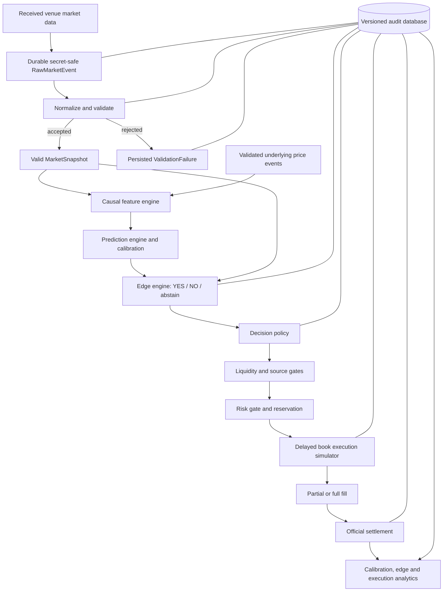

# V3 Architecture — Milestone 0 design

状态：2026-09-25，M1–M4 已实现，独立代码位于 src/btc5_v3/。M1 trustworthy data、M2 economic edge、M3 admissibility、M4 research evidence；M5 execution realism 与 M6 risk permission 仍未实现。精确实现以各阶段契约为准，最新见 [M4 契约](V3_M4_CONTRACT.md)。下方完整交易链仍含未来设计。

M4 只接收同一 experiment 的显式 ResearchObservation 归档及 post-hoc ResolvedOutcome。标签有 resolution_at 与 available_at，只有截至 cutoff 已知且晚于原决策/expiry 的匹配结算可用于评价。标签不进入 Prediction、Edge 或 Decision；变更隔离 fixture 的 outcome 只改变分析 fingerprint/results，不改变上游对象。

Calibration 是 measurement，不做 Platt/isotonic fitting。Brier payout 包含显式 split=.5；binary Brier、Log Loss、ECE/MCE/reliability 对 binary-only 样本，split 计数/频率单独报告。固定 bins/grids、Decimal 数值、确定性排序和 UTC chronological groups，不 shuffle 或伪称 OOS。

M4 输出 all-scenario 与 M3-admissible-only 的 YES/NO/combined edge view；combined 只是互斥假设的描述池，不是资金组合。Sensitivity 固定原 M3 candidate cohort，不能复活 stale/spread/depth 拒绝或切换方向。真实费用、成交和 split 概率仍未验证；hypothetical 与实际 execution 严格区分。

AnalyticsRepository 只新增 resolved_outcomes / analysis_runs / analysis_results，保存 config、Git SHA、cutoff、输入归档/hash、排除理由和创建元数据。多市场 synthetic archive 是显式独立研究 experiment；不改变 M1 collector 的逐市场 ValidatorConfig 注册约束，也不自动读取现有 V2/V3 观测库。历史结果按原归档/标签 IDs 重放，后来新增数据不被静默吸收。

## Dependency flow

拒绝是完整事件而非异常丢弃。任一阶段拒绝都保存 NO_TRADE / execution rejection、输入引用和明确原因。无成交和未结算的 PnL 为 null，不能伪装成已实现零收益。

## Proposed package boundaries

使用 `src/btc5_v3/` 包，避免与冻结 `btc5/` 混用。M1 只创建 market、storage、experiments、config 及共享编码工具、synthetic demo；未来模块不创建空壳。后续以单进程服务、SQLite 和独立 dashboard 为第一版，不拆大量微服务。

| 子包 | 输入 → 输出 / 责任 |
|---|---|
| `data/` | 独立只读行情订阅 → 先持久化不含凭证的 RawMarketEvent（包括 malformed）；连接健康 |
| `market/` | RawMarketEvent → validation event + 合法 MarketSnapshot，或 validation failure；规则绑定 |
| `features/` | 截止 available_at 的已知事件 → FeatureVector 和版本 |
| `models/` | 特征与只读模型 artifact → Prediction，含预测目标及支持域 |
| `calibration/` | 分组时间划分的训练/验证集 → 校准 artifact；独立测试评分 |
| `edge/` | Prediction、Snapshot、成本假设 → 双边 EdgeEvaluation |
| `decision/` | edge、流动性、时效、来源一致性 → BUY_YES / BUY_NO / NO_TRADE |
| `risk/` | 决策、账户与数据健康状态 → 接受并预留最大损失，或拒绝 |
| `execution/` | 已接受订单和延迟后盘口 → fills / rejection，释放未用预留 |
| `settlement/` | 官方结果 → 支付及已实现 PnL；未知结果保持 pending |
| `storage/` | 事件及引用 → 事务、唯一约束、版本信息；不负责策略 |
| `analytics/` | 不可变实验事件 → 分桶、校准、敏感性及误差归因 |
| `monitoring/` | 心跳、积压、过期和拒绝计数 → 结构化健康信息 |
| `config/` | 无凭证配置 → 校验后的配置与规范化哈希 |

纯数学模块不读数据库、不发网络请求、不读取未来快照；服务层注入 clock、provider、repository 和 risk state。adapter 不启动 V2 进程或导入有运行副作用的入口。

## Time and market contracts

所有时间为 UTC epoch milliseconds，区分 source_at（上游时间）、received_at（本机收到）、available_at（计算完成）、decision_at、execution_due_at 和 recorded_at。按 received_at 和递增 ingestion sequence 回放；相同毫秒也必须有稳定排序。未来 source_at、负 quote age、时钟异常均拒绝，不简单截成零。

MarketSnapshot 包含 market_id、observed_at/received_at、source_at、expiry、YES/NO bid/ask、双边逐档 price/quantity 深度、spread、quote_age_ms、source、reference_underlying_price、参考价时间、feed_id、opening_reference、rule_hash、outcome_mapping、market_status。深度单位为 shares；价格为每 share 的 collateral。quote_age_ms 是在评估时计算的审计值，不是永远有效的缓存属性。

Predict.fun 若只返回 YES book，可从 YES bids 推导 NO asks = 1 − YES bid，并保留 `derived` 标识和原始引用。互补深度不是独立流动性，不能重复消费。禁止将 mid 当成交价。M1 的缺失、非有限数、越界、crossed、规则或 outcome mapping 不匹配导致结构验证失败；spread 是描述字段，异常 spread 的使用门槛留待后续。stale 与 expiry 在显式使用时点通过 freshness 函数判断，不永久标记在 snapshot 上。

原始事件、验证结论、合法快照分别存储。RawMarketEvent 保留无法解析的安全载荷、接收时点和 sequence，未知 source_at/market_id 可空；验证事件记录 raw_event_id、完整拒绝原因、validator_version、validated_at 和上下文 hash。合法 MarketSnapshot 仅由验证 factory 创建且不可变，所有下游收到的对象均已满足结构和校验时点 invariant，不依赖 validation_status 二次甄别。决策时仍需按当前时间复检 freshness/expiry。详见 [ADR 0002](../decisions/0002-raw-events-and-valid-snapshots.md)。

Prediction 包含 p_yes、model_version/hash、feature_version/hash、available_at、input_cutoff、market/cycle 绑定、target_feed/rule、calibration_version 和 support_status。p_yes 表示当前市场 YES 的获胜概率，不默认 YES 就是 Up；映射需要核实。

V2 是 Binance proxy。即便价格接近，也不证明与 Chainlink 结算目标相同。规则、feed、开盘参考或目标域不一致时记 PRICE_SOURCE_MISMATCH；不得用放宽 divergence 限制绕过语义不匹配。V2 模型只作为对照，其可交易用途尚未验证。

## Edge units and cost accounting

所有 edge 统一为 collateral/share，与概率百分点可比；stake、PnL 为 collateral，二者不可直接相减。第一版仅评估 buy-and-hold-to-settlement，不涉及提前卖出或杠杆。

令 p 为有效二元合约的 p_yes，m_Y/m_N 为中间价，a_Y/a_N 为最优 ask，q 为目标 shares：

- raw_yes_edge = p − m_Y；raw_no_edge = (1 − p) − m_N。
- spread_cost(side) = ask(side) − mid(side)，不是整个 bid-ask spread。
- depth_slippage(q) = decision-time depth VWAP(q) − best ask。
- collateral-fee 情形：net_yes_edge = p − VWAP_Y − cash_fee/gross_shares − latency_cost − extra_cost。
- shares-fee 情形：net_edge = (net_shares × side_probability − collateral_spent) / gross_executed_shares；NO 使用 1−p。

等价的 raw-edge 分解扣一次 spread_cost；从 ask 起算的 EV 不再扣 spread。手续费扣 collateral 和扣 shares 会改变最终净持有 shares，不能简单当成相同固定百分点。费用适配器必须说明口径、舍入、最低费用和规则版本；未验证的费率只作为模拟假设。

已知 50/50 支付存在时，一般 EV 应使用 E[payout]。若能估计 P(YES win)、P(split)、P(NO win)，YES 的 E[payout] = P(YES win) + 0.5P(split)。V2 只有二分类输出，不隐含提供 split 概率；第一版代理研究须显式声明忽略 split 的估值假设，真实 split 结算按 0.5 记账并单列。对真实目标未校准时保持 NO_TRADE。

EdgeEvaluation 保存两侧 raw/net edge、分项成本、目标数量、可执行数量、market probability 的定义、confidence 的来源、preferred_side、原因。confidence 不等同于 edge，也不能把 max(p,1-p) 自动称为可靠胜率；未估计不确定性时为 null。

minimum_net_edge 可配置，M2 前明确预注册值，不在 M0 填一个“最优值”。选最高合格正 net edge；两侧均不合格则 NO_TRADE，精确平局也 NO_TRADE。风险与流动性约束不能通过提高预测置信度绕过。

## Execution and risk contracts

执行使用 `decision_at + latency_ms` 之后首个实际接收的有效 book，且在订单过期前。成交记录该 book 的实际接收时间，不倒签为理想执行时间。无合格新报价就拒绝或到期；不能偷用未来价格改善当时决策，也不能用信号时 ask 假装延迟成交。

M5 第一版计划为受最大价格偏离约束的 depth walk，允许 partial fill，余量立即取消；订单预留最大 collateral、限制每市场并发，模拟共用 book 深度的消费。盘口不是撮合队列证据，所有成交仍是模拟。延迟报价内已体现的实际价差不在 realized PnL 中再次扣假想 latency cost。

风险在决策和成交前都复检：单笔 stake、未结算敞口与预留、UTC 日损失、最大回撤、连续亏损、provider disconnected / stale / timestamp anomaly / source divergence / unclear rules。默认失败关闭。kill switch 停止新仓位并取消未成交订单，不能删除已有仓位；继续接收结算。恢复必须有明确且可审计的规则，不能重启即清空损失历史。

## Unverified assumptions

真实费用口径和舍入、延迟分布、可消费深度、报价丢失、参考价格一致性、split 编码及出现率、模型对结算目标的校准、样本独立性均需后续证据。M0 不声称存在可交易 edge，不读取 V2 当前收益来支持这些假设。
